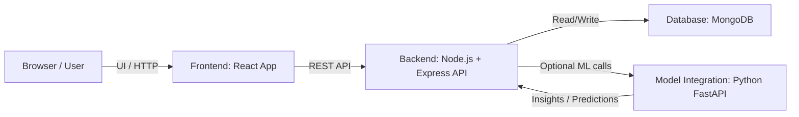
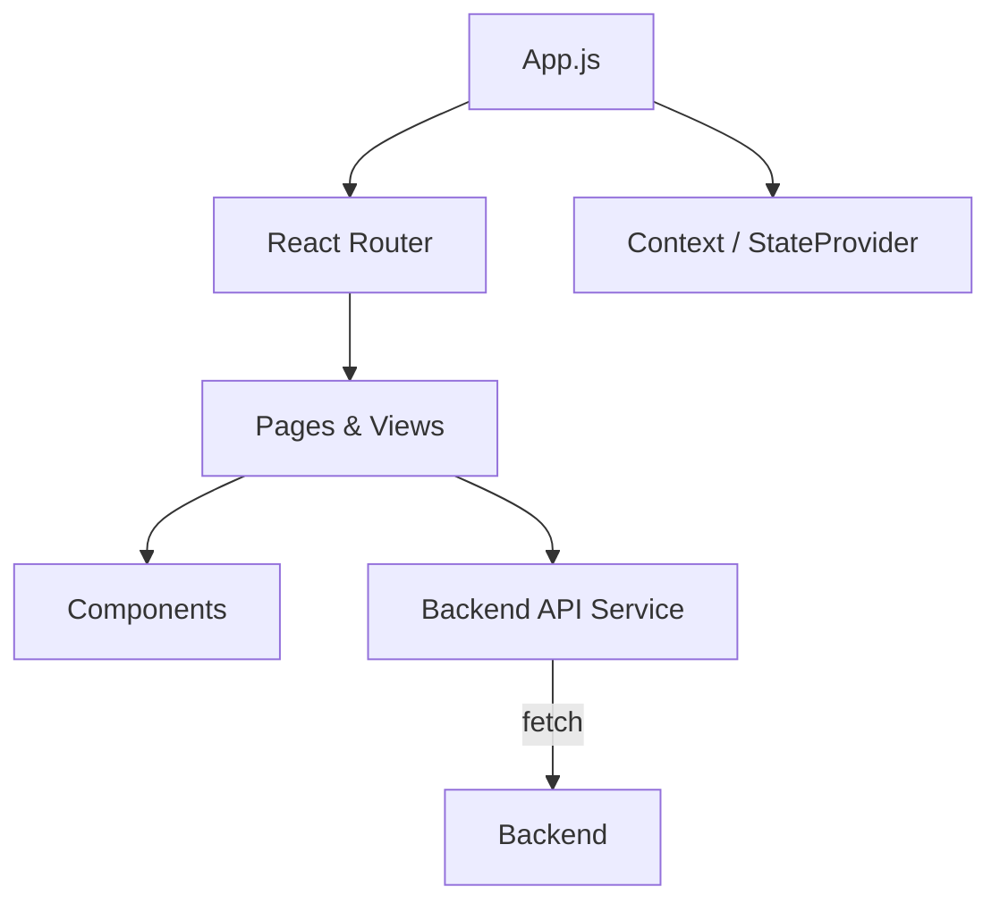
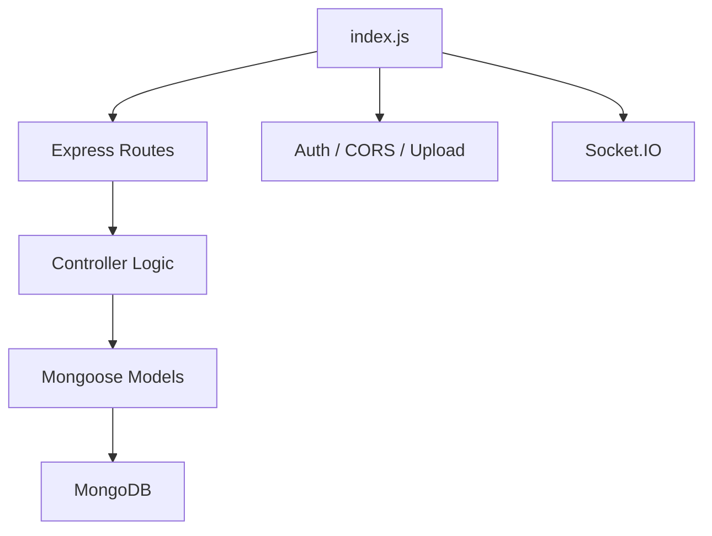
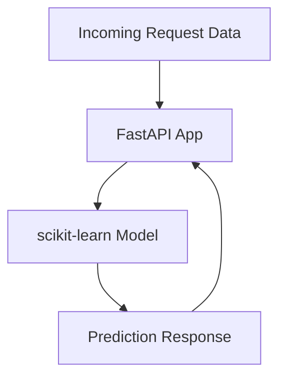
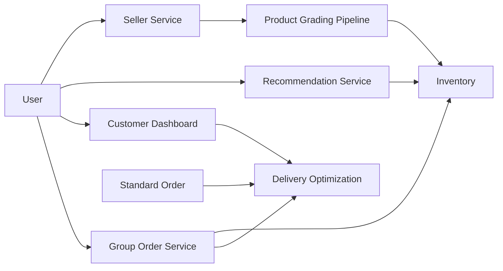
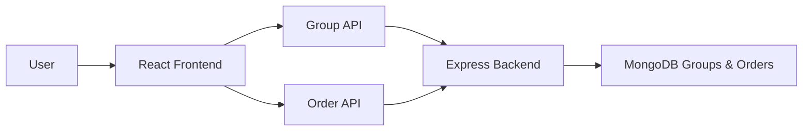

# Sustainability Project

A full-stack sustainability-focused e-commerce solution built with React, Node.js, MongoDB, and Python. This repository combines a frontend shopping experience, a backend API server, and a model integration microservice for sustainability insights and recommendations.

---

## 🚀 Project Overview

**Sustainability Project** helps users discover eco-friendly products, join group orders, and track the environmental impact of every purchase.

Key capabilities:
- Sustainable product browsing and checkout.
- Group order creation and joining.
- Dashboard insights for sustainability metrics.
- Optional ML service for prediction and analytics.

---

## 🏗️ Architecture Overview

### High-Level Architecture



This high-level architecture describes how the system components connect:
- The browser runs the React frontend and presents the user interface.
- The frontend sends REST API requests to the Node.js backend.
- The backend reads and writes data in MongoDB.
- The backend optionally calls the Python FastAPI ML service for sustainability insights or predictions.

### What this is and how it works
This is the application’s overall workflow. The frontend is the user-facing side, the backend handles data and business logic, the database stores persistent information, and the ML service is an optional analytics layer. Implementation uses HTTP between components, with the backend acting as the central coordinator.

### Frontend Low-Level Architecture



The frontend architecture shows how React constructs pages:
- `App.js` configures routing and shared state.
- React Router maps URLs to page components.
- The Context `StateProvider` shares user and cart data across the app.
- Page components render UI components and call backend APIs.

### What this is and how it works
This section explains the browser-side implementation. The React app is implemented as a single-page application (SPA) with route-based views, local state management via context, and component-driven UI. API fetch calls are used to retrieve and submit order, product, and group data.

### Backend Low-Level Architecture



The backend architecture shows the Node.js server structure:
- `index.js` boots the Express server and configures middleware.
- Routes define API endpoints for login, signup, orders, products, and groups.
- Controllers contain business logic for handling requests.
- Mongoose models define schemas and interact with MongoDB.
- Socket.IO is available for real-time notifications and user updates.

### What this is and how it works
This is the service layer implementation. The Express backend receives requests from the frontend, validates them with middleware, executes controller logic, and persists data using Mongoose models. It also supports authentication and optional real-time messaging.

### Model Integration Low-Level Architecture



The model integration architecture shows the ML microservice:
- FastAPI exposes one or more endpoints from `main.py`.
- Incoming request data is validated and passed to a loaded scikit-learn model.
- The model returns an insight, score, or prediction in JSON.

### What this is and how it works
This is the analytics service implementation. It is a separate Python microservice that can be called by the backend. FastAPI handles HTTP requests, loads the ML model, computes predictions, and responds with structured results.

---

## 🧠 Interview Explanation: What to Say

### Project Goal
The goal is to create a *sustainable shopping experience* with an AI-first marketplace. The app combines eco-friendly product discovery, product grading, recommendation, sustainability impact tracking, and a group-order delivery model.

### What I Built
- An **AI-powered recommendation system** that suggests eco-friendly products.
- An **AI-powered product grading system** that scores products from `A+` to `C`.
- A **customer dashboard** that visualizes carbon footprint reduction.
- A **sustainable packaging and group order mechanism** to reduce delivery resources.

### How the Product Grading Service Works
This is the seller-side service.
- Sellers provide product details such as carbon reduction %, weight, lifespan, and whether the product is renewable, recyclable, or supports sustainable packaging.
- If the product is marked sustainable, the system asks for supporting certificates like FSC or eco-friendly approvals.
- The grading pipeline uses a multi-modal model built with **Random Forest**, **XGBoost**, and **LightGBM regression**.
- The model was trained on a dataset of **600,000 records** and reached **99.2% accuracy**.
- The output is a product grade on a scale from **A+**, **A**, **B+**, **B**, to **C**.
- After grading, the product is stored in the seller inventory.

### How the Customer Microservices Work
This is the buyer-side service.
- The recommendation engine uses **cosine similarity** to find the top 5 eco-friendly products in inventory.
- The customer dashboard is built with **Recharts** in React and uses **GeoJSON** for location-aware visualization.
- The dashboard visualizes carbon footprint reduction, impact metrics, and customer engagement.

### How the Group Order Service Works
- Customers can choose a **standard order** or a **group order**.
- Standard order works like normal delivery.
- Group order provides two options:
  1. **Join an existing group** by checking range and deadline.
  2. **Create a new group** by selecting a deadline and waiting for others to join.
- Group ordering helps dispatch nearby deliveries together and can reduce delivery resource usage by **about 30%** when 1 in 5 customers uses it.

### Seller and Customer Architecture
- Seller microservices use **MongoDB** for product inventory and grading data.
- Customer microservices use **PostgreSQL** for recommendation and customer engagement data.
- The frontend uses **React.js**.
- The backend uses **Node.js**.
- ML integration uses **FastAPI**.

### Interview-Ready Mermaid Diagram



### How to explain it to an interviewer
Start with the main goal: *build a sustainable shopping experience*. Then explain the two main service groups:
- **Seller service** for eco product grading and inventory.
- **Customer service** for recommendations, dashboards, and group ordering.

Point out that the system uses AI models for grading and recommendation, and that group ordering is designed to reduce delivery resources and improve sustainability.

---

## �🧩 Service Tech Stack

| Service | Technologies | Purpose |
|---|---|---|
| Frontend | React, React Router, Tailwind CSS, party-js, @react-google-maps/api | Customer UI, group order flows, dashboards |
| Backend | Node.js, Express, MongoDB, Mongoose, JWT, bcrypt, Socket.IO | API endpoints, persistence, authentication |
| Model Integration | Python, FastAPI, Uvicorn, scikit-learn, NumPy | Analytics, recommendation-ready ML service |

---

## 🧠 Why This Stack Was Chosen

| Technology | Why Used | Compared Against | Why Not Used |
|---|---|---|---|
| React | Fast SPA rendering, reusable UI, strong ecosystem for dashboards | Angular | Avoids larger, more opinionated frontend framework complexity |
| Tailwind CSS | Rapid styling with utility-first approach | Bootstrap / Material UI | Avoids heavier CSS frameworks and global style overrides |
| Node.js + Express | Lightweight backend with easy MongoDB integration | Java Spring / .NET | Avoids heavier JVM or .NET stacks for faster hackathon prototyping |
| MongoDB | Flexible document model for orders, products, groups | PostgreSQL / MySQL | Avoids rigid relational schemas during early PoC development |
| FastAPI | Modern Python API with built-in docs and validation | Flask | Avoids extra boilerplate and slower request validation setup |
| scikit-learn | Proven Python library for prototype ML analytics | TensorFlow / PyTorch | Avoids deep learning overhead for simpler recommendation models |

---

## 🔧 Quick Start

### Prerequisites
- Node.js 16+ and npm
- Python 3.9+
- MongoDB running locally or remotely
- Git

### Backend

```bash
cd backend
npm install
# Configure .env with MongoDB URI, JWT_SECRET, etc.
npm run dev
```

### Frontend

```bash
cd Green-Commerce
npm install
npm start
```

### Model Integration

```bash
cd modelIntegration
python -m venv myenv
myenv\Scripts\activate
pip install -r requirements.txt
uvicorn main:app --reload
```

---

## 📈 Folder Structure

```text
sustainability/
├── backend/
│   ├── controllers/
│   ├── database/
│   ├── middlewares/
│   ├── routes/
│   ├── storageSchema/
│   ├── index.js
│   └── package.json
├── Green-Commerce/
│   ├── public/
│   ├── src/
│   ├── package.json
│   └── tailwind.config.js
├── modelIntegration/
│   ├── main.py
│   ├── requirements.txt
│   └── grade_predictor.pkl
└── README.md
```

---

## 🛠️ How the Pieces Work Together
- The **React frontend** consumes API routes from the **Express backend**.
- The **backend** stores products, orders, groups, and users in **MongoDB**.
- The **backend** optionally calls the **FastAPI ML service** for sustainability insights.
- The ML service returns predictions and analytics that enhance the user experience.

---

## 📦 Group Order Architecture



### How Group Orders Work

The group order flow has two main paths:

1. **Create a Group Order**
   - The user opens `GroupOrderSetup` in the frontend.
   - The app captures the user location and collects group details like name, deadline, cart items, and location name.
   - The frontend sends a `POST /group/create` request to the backend with group metadata and members.
   - The backend saves the new group in MongoDB using a geo-enabled group schema.
   - After group creation, the frontend may also create a standard order via `POST /place-order`.
   - The user receives a shareable group link and can invite others.

2. **Join an Existing Group Order**
   - The user opens `NearbyGroups` in the frontend.
   - The app gets the current location and requests `GET /group/nearby` with coordinates and radius.
   - The backend returns nearby groups using MongoDB geospatial queries.
   - The user selects a group and the frontend sends `POST /group/join/:id`.
   - The backend adds the user to the group's `members` list.
   - The frontend retrieves group cart details and sends a `POST /place-order` to record the individual order.

### What This Is and How It Is Implemented

This architecture describes the group order collaboration flow:
- A group represents a shared order location, deadline, shopping cart, and member list.
- Creating a group stores both group metadata and the initial cart state.
- Joining a group updates the membership list and duplicates the shared cart into a personal order.
- The backend uses Express routes in `backend/routes/group.js` and `backend/routes/orderRoutes.js`.
- MongoDB stores group documents with `location` as a GeoJSON point, `members` as an email array, and `cartItems` as the shared item list.

This implementation enables sustainable shopping together by combining location-aware group discovery, shared cart information, and per-user order tracking.

---

## �📌 Notes
- Use the backend `routes/` folder to inspect API endpoints.
- Use `Green-Commerce/src/Component` for UX flows and dashboard components.
- Use `modelIntegration/main.py` to extend recommendation logic.

---

## 📄 License

This project is provided for hackathon learning and sustainability experimentation.

Built with 💚 for sustainability!
    │       │   ├── Footer.js
    │       │   ├── GreenProducts.js
    │       │   ├── GroupCard.js
    │       │   ├── GroupOrderSetup.js
    │       │   ├── Header.js
    │       │   ├── Headergreen.js
    │       │   ├── Home.js
    │       │   ├── Homegreen.js
    │       │   ├── Imageslidegreen.js
    │       │   ├── Imageslider.js
    │       │   ├── Login.js
    │       │   ├── MyGroups.js
    │       │   ├── MyOrders.js
    │       │   ├── navbar.js
    │       │   ├── navbargreen.js
    │       │   ├── NearbyGroups.js
    │       │   ├── NormalHeader.js
    │       │   ├── OrderConfirmation.js
    │       │   ├── OrderConfirmationWrapper.js
    │       │   ├── orderedProduct.js
    │       │   ├── OrderPage.js
    │       │   ├── OrderPageWrapper.js
    │       │   ├── Orders.js
    │       │   ├── Product.js
    │       │   ├── Productbutton.js
    │       │   ├── Productbutton1.js
    │       │   ├── ProductDetails.js
    │       │   ├── ProductDetails1.js
    │       │   ├── Productgreen.js
    │       │   ├── ProductPage.js
    │       │   ├── reducer.js
    │       │   ├── RewardEarned.js
    │       │   ├── Rewards.js
    │       │   ├── SellerSection.js
    │       │   ├── Signup.js
    │       │   ├── StandardDashboard.js
    │       │   ├── StateProvider.js
    │       │   ├── Submitted.js
    │       │   ├── Subtotal.js
    │       │   ├── Sustainability.js
    │       │   ├── thanks.js
    │       │   └── carosel/
    │       │       ├── SuggestGreenBrands.js
    │       │       └── SuggestGreenCategory_carosel1.js
    │       ├── Css/
    │       │   ├── Checkout.css
    │       │   ├── CheckoutProduct.css
    │       │   ├── Dashboard.css
    │       │   ├── Educationsection.css
    │       │   ├── Feedback.css
    │       │   ├── Feedbacksubmitted.css
    │       │   ├── Footer.css
    │       │   ├── GroupCard.css
    │       │   ├── GroupOrder.css
    │       │   ├── Header.css
    │       │   ├── Headergreen.css
    │       │   ├── Home.css
    │       │   ├── Homegreen.css
    │       │   ├── Imageslidegreen.css
    │       │   ├── ImageSlider.css
    │       │   ├── Login.css
    │       │   ├── MyGroups.css
    │       │   ├── navbar.css
    │       │   ├── navbargreen.css
    │       │   ├── NearbyGroups.css
    │       │   ├── OrderConfirmation.css
    │       │   ├── orderedProduct.css
    │       │   ├── OrderPage.css
    │       │   ├── Orders.css
    │       │   ├── Product.css
    │       │   ├── Productbutton.css
    │       │   ├── ProductDetails.css
    │       │   ├── Productgreen.css
    │       │   ├── SellerSection.css
    │       │   ├── Submitted.css
    │       │   ├── Subtotal.css
    │       │   ├── Sustainability.css
    │       │   └── Thanks.css
    │       └── utils/
    │           └── socket.js
    ├── modelIntegration/
    │   ├── grade_predictor.pkl
    │   ├── main.py
    │   └── .gitignore
```

## 📈 Future Roadmap
   •  User authentication & profiles
   •  Real-time notifications
   •  Shared payments & split checkout
   •  CI/CD pipelines & cloud deployment
   •  Mobile app integration

## 📄 License
This project is licensed under the MIT License
 Built with 💚 for sustainability!


## deployment:
        •   backend : https://amazon-hackon-s2-buckets.vercel.app/
   •       frontend:   

 
 


## Fast api commonds for easy setup
• python -m venv myenv
• myenv\Scripts\activate
• pip install fastapi uvicorn pydantic
• pip install pandas numpy
• pip install scikit-learn==1.6.1
• uvicorn main:app --reload

