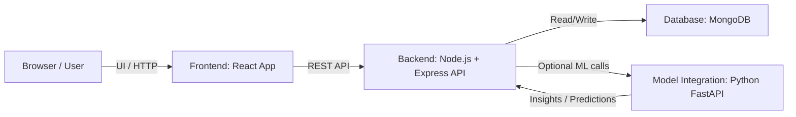
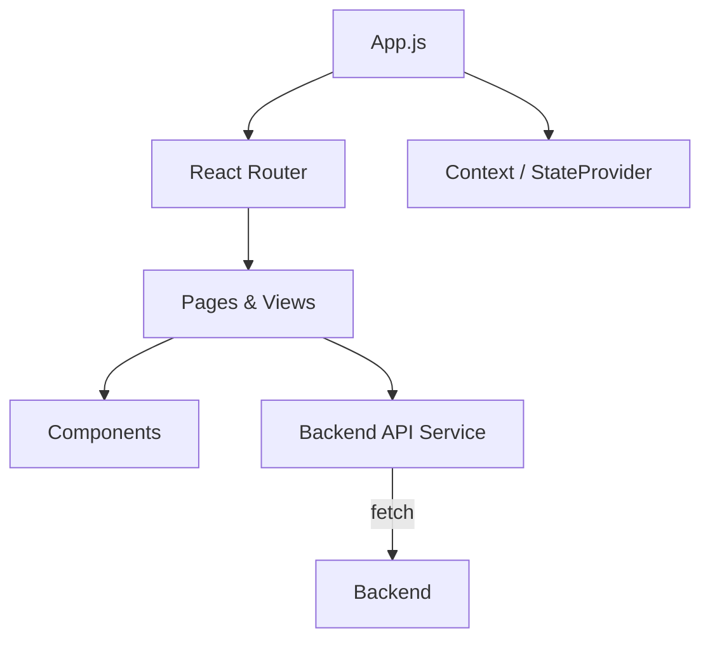
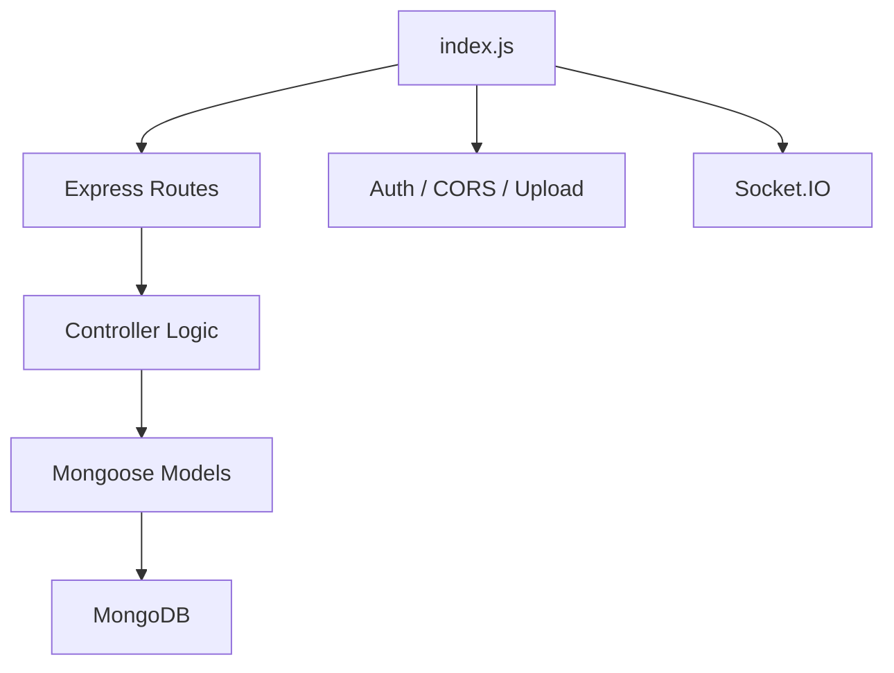

# Sustainability Project

A full-stack sustainability-focused e-commerce solution built with React, Node.js, MongoDB, and Python. This repository combines a frontend shopping experience, a backend API server, and a model integration microservice for sustainability insights and recommendations.

---

## 🚀 Project Overview

**Sustainability Project** helps users discover eco-friendly products, join group orders, and track the environmental impact of every purchase.

Key capabilities:
- Sustainable product browsing and checkout.
- Group order creation and joining.
- Dashboard insights for sustainability metrics.
- Optional ML service for prediction and analytics.

---

## 🏗️ Architecture Overview

### High-Level Architecture



This high-level architecture describes how the system components connect:
- The browser runs the React frontend and presents the user interface.
- The frontend sends REST API requests to the Node.js backend.
- The backend reads and writes data in MongoDB.
- The backend optionally calls the Python FastAPI ML service for sustainability insights or predictions.

### What this is and how it works
This is the application’s overall workflow. The frontend is the user-facing side, the backend handles data and business logic, the database stores persistent information, and the ML service is an optional analytics layer. Implementation uses HTTP between components, with the backend acting as the central coordinator.

### Frontend Low-Level Architecture



The frontend architecture shows how React constructs pages:
- `App.js` configures routing and shared state.
- React Router maps URLs to page components.
- The Context `StateProvider` shares user and cart data across the app.
- Page components render UI components and call backend APIs.

### What this is and how it works
This section explains the browser-side implementation. The React app is implemented as a single-page application (SPA) with route-based views, local state management via context, and component-driven UI. API fetch calls are used to retrieve and submit order, product, and group data.

### Backend Low-Level Architecture



The backend architecture shows the Node.js server structure:
- `index.js` boots the Express server and configures middleware.
- Routes define API endpoints for login, signup, orders, products, and groups.
- Controllers contain business logic for handling requests.
- Mongoose models define schemas and interact with MongoDB.
- Socket.IO is available for real-time notifications and user updates.

### What this is and how it works
This is the service layer implementation. The Express backend receives requests from the frontend, validates them with middleware, executes controller logic, and persists data using Mongoose models. It also supports authentication and optional real-time messaging.

### Model Integration Low-Level Architecture

```mermaid
flowchart TD
  data[Incoming Request Data]
  api[FastAPI App]
  model[scikit-learn Model]
  response[Prediction Response]

  data