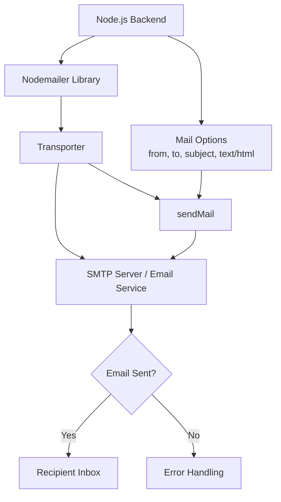

What is Nodemailer?
Nodemailer is a Node.js library used to send emails from your backend/server.
Think of Nodemailer as a postal service built into your Node.js application. Just like you hand a letter to a postman who knows the routes and delivers it, Nodemailer takes your email content and delivers it to the recipient's inbox using existing email servers.
It's a Node.js library — meaning you just npm install it, and your backend app can send emails.

The core concepts
1. Transporter — the "postman"
Before sending any email, you create a transporter. This is the object that knows how and where to send emails — which email server to use, and what credentials to authenticate with.
jsconst nodemailer = require('nodemailer');

const transporter = nodemailer.createTransport({
  service: 'gmail',  // or 'yahoo', or any SMTP server
  auth: {
    user: 'you@gmail.com',
    pass: 'your-app-password'
  }
});
Think of this like hiring a specific courier (Gmail, Outlook, your company's mail server) and giving them your ID card so they trust you.

2. SMTP — the language emails speak
Nodemailer uses SMTP (Simple Mail Transfer Protocol) — the universal standard that email servers use to talk to each other. You don't need to understand the protocol deeply, but you need to know:

Host: the SMTP server address (e.g. smtp.gmail.com)
Port: usually 587 (TLS) or 465 (SSL)
Auth: your username and password (or an API key)

Here's a manual SMTP setup instead of using the shorthand service:
jsconst transporter = nodemailer.createTransport({
  host: 'smtp.gmail.com',
  port: 587,
  secure: false,  // true for port 465
  auth: {
    user: 'you@gmail.com',
    pass: 'your-app-password'
  }
});

3. Mail options — the "letter content"
Once your transporter (postman) is ready, you describe the email itself:
jsconst mailOptions = {
  from: '"My App" <you@gmail.com>',
  to: 'friend@example.com',
  subject: 'Welcome to our app!',
  text: 'Hello! Thanks for signing up.',   // plain text
  html: '<h1>Hello!</h1>
Thanks for signing up.
'  // HTML version
};
You can send to multiple recipients, add CC/BCC, attach files, and even embed images — all in this options object.

4. Sending the email
jstransporter.sendMail(mailOptions, (error, info) => {
  if (error) {
    console.log('Error:', error);
  } else {
    console.log('Email sent:', info.response);
  }
});
Or with async/await (cleaner in modern code):
jsasync function sendEmail() {
  try {
    const info = await transporter.sendMail(mailOptions);
    console.log('Message sent:', info.messageId);
  } catch (error) {
    console.error('Failed:', error);
  }
}

## High-Level Nodemailer Working Diagram

