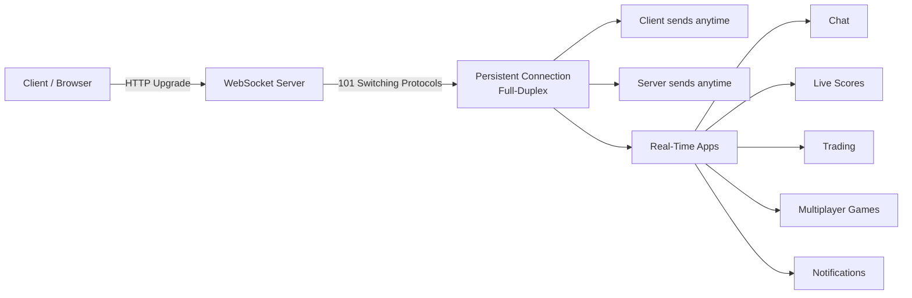

What is WebSocket?
WebSocket is a full-duplex communication protocol that enables real-time bidirectional communication between client and server over a single persistent connection.

Client ↔ Server

Both can send data anytime without reconnecting repeatedly.

Why WebSocket?

Normal HTTP:

Request → Response → Connection Closed

WebSocket:

Connection stays open continuously

Best for:

Chat apps
Live notifications
Live scores
Trading apps
Multiplayer games
How WebSocket Works (Workflow)
Step 1: Client requests connection

Browser sends HTTP upgrade request:

Upgrade: websocket
Step 2: Server accepts

Server replies:

101 Switching Protocols

Now HTTP becomes WebSocket.

Step 3: Persistent connection starts

Now both can communicate anytime:

Client → Server
Server → Client

No repeated requests needed.

Real-life Workflow Example (WhatsApp)
Without WebSocket
Phone asks server every second:
"Any new message?"

Too many requests.

With WebSocket
Phone stays connected.

Friend sends message →
Server instantly pushes message →
You receive instantly.

Real-life Use Cases
App Type	Use
WhatsApp	Messaging
LinkedIn	Notifications
IPL         Live Score	Live updates
Crypto apps	Real-time prices
Google Docs	Live collaboration
Games	    Player movement

Important Terms
Term	Meaning
ws://	Normal WebSocket
wss://	Secure WebSocket
Handshake	Initial connection setup
Persistent Connection	Connection remains open
Full Duplex	Both sides communicate simultaneously
Useful Frontend Code

Useful Backend Code (Node.js)

Install:

npm install ws

Server:

const WebSocket = require("ws");

const server = new WebSocket.Server({ port: 8080 });

server.on("connection", (socket) => {
  console.log("Client connected");

  socket.send("Welcome Client");

  socket.on("message", (msg) => {
    console.log(msg.toString());

    socket.send("Message received");
  });
});

Run:

node server.js

## WebSocket Components and Working Diagram

